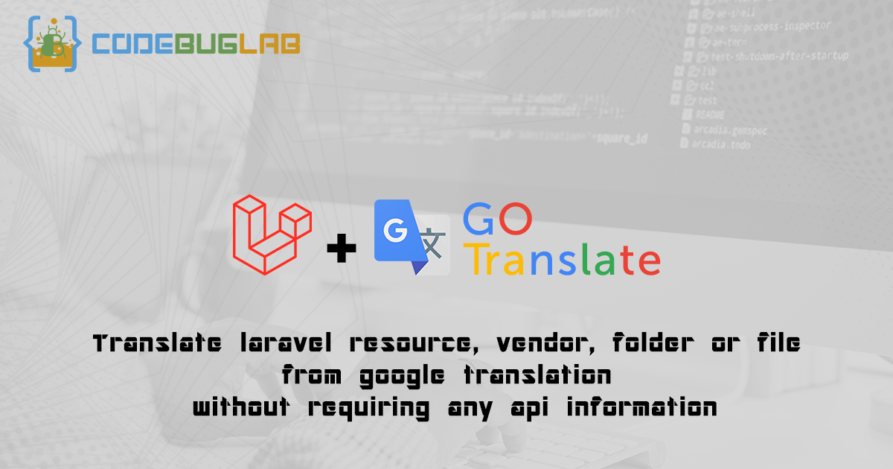
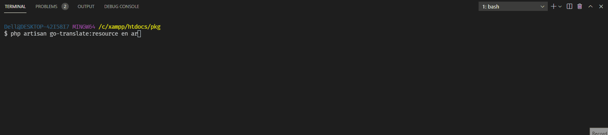
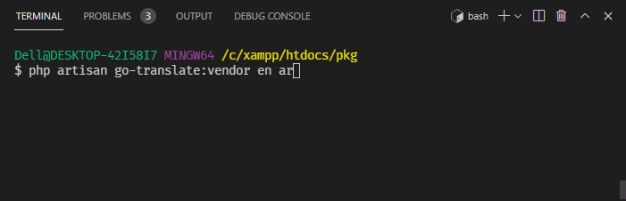
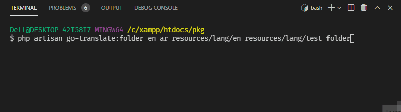
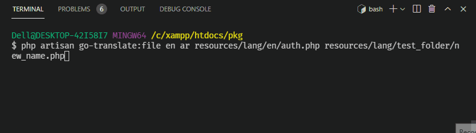
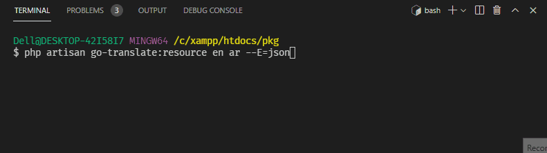

# ⚡⚡⚡ Laravel Go Translate

Translate laravel resource, vendor, folder or file from google translation without requiring any api information.



## Table of contents <!-- omit in toc -->

- [Installation](#installation)
- [Translate Commands](#translatecommands)
  - [Resource](#resource)
  - [Vendor](#vendor)
  - [Folder](#folder)
  - [File](#file)
- [Options](#Options)
  - [Extension](#extension)
- [Notices](#notices)
- [License](#license)

## Installation

To install this package through composer run the following command in the terminal

```bash
composer require codebuglab/laravel-go-translate
```
Or if you want to use it only on development mode
```bash
composer require codebuglab/laravel-go-translate --dev
```

## Translate Commands
- This package can translate laravel project by multiple ways from `php` or `json` files


### Resource
```
php artisan go-translate:resource {sourceLang} {destinationLang}
```
- This command take `sourceLang` and `destinationLang` as variables and translate all files in `resources/lang/{sourceLang}`
to `resources/lang/{destinationLang}`
```
php artisan go-translate:resource en ar
```
- This is an example of a command will translate all files in `resources/lang/en` folder and transfer them to `resources/lang/ar` folder after translation from `en` to `ar`




### Vendor
```
php artisan go-translate:vendor {sourceLang} {destinationLang}
```
- This command take `sourceLang` and `destinationLang` as variables and translate all files in `resources/lang/vendor/{sourceLang}`
to `resources/lang/vendor/{destinationLang}`
```
php artisan go-translate:vendor en ar
```
- This is an example of a command will translate all files in `resources/lang/vendor/en` folder and transfer them to `resources/lang/vendor/ar` folder after translation from `en` to `ar`




### Folder
```
php artisan go-translate:folder {sourceLang} {destinationLang} {sourceFolder} {destinationFolder}
```
- This command take `sourceLang`, `destinationLang`, `sourceFolder` and `destinationFolder` as variables and translate all files in `{sourceFolder}` to `{destinationFolder}` from `{sourceLang}` to `{destinationLang}`
```
php artisan go-translate:folder en ar resources/lang/en resources/lang/test_folder
```
- This is an example of a command will translate all files in `resources/lang/en` folder and transfer them to `resources/lang/test_folder` folder after translation from `en` to `ar`




### File
```
php artisan go-translate:file {sourceLang} {destinationLang} {sourcePath} {destinationPath}
```
- This command take `sourceLang`, `destinationLang`, `sourcePath` and `destinationPath` as variables and translate `{sourcePath}` file to `{destinationPath}` from `{sourceLang}` to `{destinationLang}`
```
php artisan go-translate:file en ar resources/lang/en/auth.php resources/lang/test_folder/new_name.php
```
- This is an example of a command will translate the file in `resources/lang/en/auth.php` and transfer it to `resources/lang/test_folder/new_name.php` file after translation from `en` to `ar`




## Options


### Extension
```
php artisan go-translate:resource {sourceLang} {destinationLang} {--E=json}
```
- `--E` is an optional variable you can convert php files to json during translation
```
php artisan go-translate:resource en ar --E=json
```
- This option wouldn't only translate files in `resources/lang/en` to `resources/lang/ar`, This will also convert files to json during translation
- An example of that `resources/lang/en/auth.php` which is based laravel file created with all projects will translate and save at `resources/lang/ar/auth.json`
- Current extension options for reading and converting are `json`, `php`




## Notices

- this package build upon [dejurin/php-google-translate-for-free](https://github.com/dejurin/php-google-translate-for-free) package which use google translate to translate languages and some times you take bans from google for translating multiple lines in a few amount of time, So and for now if you face some problems during translating exit command by clicking `ctrl+c` and try to change your ip address of wait for couple or hours till the ban ends.


## License

This package is a free software distributed under the terms of the MIT license.
